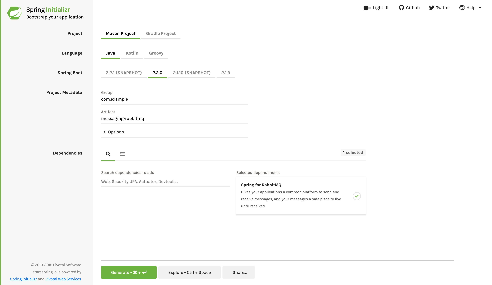

:spring_boot_version: 2.2.1.RELEASE
:toc:
:icons: font
:source-highlighter: prettify
:project_id: gs-messaging-rabbitmq

This guide walks you through the process of setting up a RabbitMQ AMQP server that
publishes and subscribes to messages and creating a Spring Boot application to interact
with that RabbitMQ server.

== What You Will Build

You will build an application that publishes a message by using Spring AMQP's
`RabbitTemplate` and subscribes to the message on a POJO by using
`MessageListenerAdapter`.

== What You Need

:java_version: 1.8
include::https://raw.githubusercontent.com/spring-guides/getting-started-macros/master/prereq_editor_jdk_buildtools.adoc[]
+
- Set up the RabbitMQ server. See <<scratch>>.

include::https://raw.githubusercontent.com/spring-guides/getting-started-macros/master/how_to_complete_this_guide.adoc[]

[[scratch]]
== Set up the RabbitMQ Broker

Before you can build your messaging application, you need to set up a server to handle
receiving and sending messages.

RabbitMQ is an AMQP server. The server is freely available at
https://www.rabbitmq.com/download.html. You can download it manually or, if you use
a Mac with Homebrew, by running the following command in a terminal window:

====
[source,bash]
----
brew install rabbitmq
----
====

Unpack the server and launch it with default settings by running the following command in
a terminal window:

====
[source,bash]
----
rabbitmq-server
----
====

You should see output similar to the following:

====
[source,bash]
----
            RabbitMQ 3.1.3. Copyright (C) 2007-2013 VMware, Inc.
##  ##      Licensed under the MPL.  See https://www.rabbitmq.com/
##  ##
##########  Logs: /usr/local/var/log/rabbitmq/rabbit@localhost.log
######  ##        /usr/local/var/log/rabbitmq/rabbit@localhost-sasl.log
##########
            Starting broker... completed with 6 plugins.
----
====

You can also use https://docs.docker.com/compose/[Docker Compose] to quickly launch a
RabbitMQ server if you have Docker running locally. There is a `docker-compose.yml` in the
root of the `complete` project in Github. It is very simple, as the following listing
shows:

====
[source,yaml]
----
rabbitmq:
  image: rabbitmq:management
  ports:
    - "5672:5672"
    - "15672:15672"
----
====
With this file in the current directory, you can run `docker-compose up` to get RabbitMQ
running in a container.

[[initial]]
== Starting with Spring Initializr

For all Spring applications, you should start with the https://start.spring.io[Spring
Initializr]. The Initializr offers a fast way to pull in all the dependencies you need for
an application and does a lot of the set up for you. This example needs only the Spring
for RabbitMQ dependency. The following image shows the Initializr set up for this sample
project:

NOTE: The preceding image shows the Initializr with Maven chosen as the build tool. You
can also use Gradle. It also shows values of `com.example` and `messaging-rabbitmq` as the
Group and Artifact, respectively. You will use those values throughout the rest of this
sample.

The following listing shows the `pom.xml` file that is created when you choose Maven:

====
[src,xml]
----
include::complete/pom.xml[]
----
====

The following listing shows the `build.gradle` file that is created when you choose Gradle:

====
[src,java]
----
include::complete/build.gradle[]
----
====

== Create a RabbitMQ Message Receiver

With any messaging-based application, you need to create a receiver that responds to
published messages. The following listing (from
`src/main/java/com.example.messagingrabbitmq/Receiver.java`) shows how to do so:

====
[source,java,tabsize=2]
----
include::complete/src/main/java/com/example/messagingrabbitmq/Receiver.java[]
----
====

The `Receiver` is a POJO that defines a method for receiving messages. When you register
it to receive messages, you can name it anything you want.

NOTE: For convenience, this POJO also has a `CountDownLatch`. This lets it signal that the
message has been received. This is something you are not likely to implement in a
production application.

== Register the Listener and Send a Message

Spring AMQP's `RabbitTemplate` provides everything you need to send and receive messages
with RabbitMQ. However, you need to:

- Configure a message listener container.
- Declare the queue, the exchange, and the binding between them.
- Configure a component to send some messages to test the listener.

NOTE: Spring Boot automatically creates a connection factory and a RabbitTemplate,
reducing the amount of code you have to write.

You will use `RabbitTemplate` to send messages, and you will register a `Receiver` with
the message listener container to receive messages. The connection factory drives both,
letting them connect to the RabbitMQ server. The following listing (from
`src/main/java/com.example.messagingrabbitmq/MessagingRabbitApplication.java`) shows how
to create the application class:

====
[source,java,tabsize=2]
----
include::complete/src/main/java/com/example/messagingrabbitmq/MessagingRabbitmqApplication.java[]
----
====

include::https://raw.githubusercontent.com/spring-guides/getting-started-macros/master/spring-boot-application-new-path.adoc[]

The bean defined in the `listenerAdapter()` method is registered as a message listener in
the container (defined in `container()`). It listens for messages on the `spring-boot`
queue. Because the `Receiver` class is a POJO, it needs to be wrapped in the
`MessageListenerAdapter`, where you specify that it invokes `receiveMessage`.

NOTE: JMS queues and AMQP queues have different semantics. For example, JMS sends queued
messages to only one consumer. While AMQP queues do the same thing, AMQP producers do not
send messages directly to queues. Instead, a message is sent to an exchange, which can go
to a single queue or fan out to multiple queues, emulating the concept of JMS topics.

The message listener container and receiver beans are all you need to listen for messages.
To send a message, you also need a Rabbit template.

The `queue()` method creates an AMQP queue. The `exchange()` method creates a topic
exchange. The `binding()` method binds these two together, defining the behavior that
occurs when `RabbitTemplate` publishes to an exchange.

NOTE: Spring AMQP requires that the `Queue`, the `TopicExchange`, and the `Binding` be
declared as top-level Spring beans in order to be set up properly.

In this case, we use a topic exchange, and the queue is bound with a routing key of
`foo.bar.#`, which means that any messages sent with a routing key that begins with
`foo.bar.` are routed to the queue.

== Send a Test Message

In this sample, test messages are sent by a `CommandLineRunner`, which also waits for the
latch in the receiver and closes the application context. The following listing (from
`src/main/java/com.example.messagingrabbitmq/Runner.java`) shows how it works:

====
[source,java,tabsize=2]
----
include::complete/src/main/java/com/example/messagingrabbitmq/Runner.java[]
----
====

Notice that the template routes the message to the exchange with a routing key of
`foo.bar.baz`, which matches the binding.

In tests, you can mock out the runner so that the receiver can be tested in isolation.

== Run the Application

The `main()` method starts that process by creating a Spring application context. This
starts the message listener container, which starts listening for messages. There is a
`Runner` bean, which is then automatically run. It retrieves the `RabbitTemplate` from the
application context and sends a `Hello from RabbitMQ!` message on the `spring-boot` queue.
Finally, it closes the Spring application context, and the application ends.

include::https://raw.githubusercontent.com/spring-guides/getting-started-macros/master/build_an_executable_jar_mainhead.adoc[]

include::https://raw.githubusercontent.com/spring-guides/getting-started-macros/master/build_an_executable_jar_with_both.adoc[]

You should see the following output:

====
[source,bash]
----
    Sending message...
    Received <Hello from RabbitMQ!>
----
====

== Summary

Congratulations! You have just developed a simple publish-and-subscribe application with
Spring and RabbitMQ. You can do more with
https://docs.spring.io/spring-amqp/reference/#_introduction[Spring and RabbitMQ]
than what is covered here, but this guide should provide a good start.

== See Also

The following guides may also be helpful:

* https://spring.io/guides/gs/messaging-redis/[Messaging with Redis]
* https://spring.io/guides/gs/messaging-jms/[Messaging with JMS]
* https://spring.io/guides/gs/spring-boot/[Building an Application with Spring Boot]

include::https://raw.githubusercontent.com/spring-guides/getting-started-macros/master/footer.adoc[]
